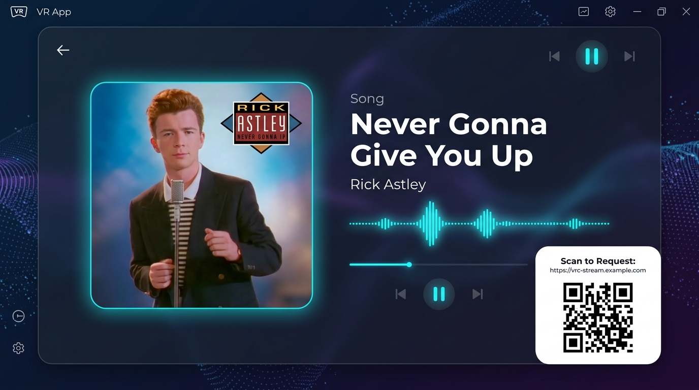

# 🔮 将来の機能拡張案・バックログ (Future Ideas & Backlog)

本ドキュメントは、VRCYouTube Streamer の今後のバージョンアップ候補として検討されたアイデアや設計案を記録するバックログです。

---

## 1. 📻 YouTubeサムネイル＆ラジオ風カード画面の自動生成 (Radio Card Visualizer)

### 概要
BGM/ラジオモード再生時、YouTubeから取得したサムネイル画像（アルバムアート風）と動画タイトル・アーティスト情報、音楽波形ビジュアライザー、スマホリクエスト用QRコードを1枚の洗練された **「1920x1080 ラジオ番組風カード画面」** として自動合成・生成する機能。

### UIモックアップ

### 画面レイアウト構成
1. **左側（アルバムアート領域）**:
   - `yt-dlp` で取得した高画質サムネイル（`maxresdefault` / `hqdefault`）を自動ダウンロード
   - 角丸（Corner Radius）、ネオンブルー/シアンの発光シャドウ（Glow Effect）で装飾
2. **中央〜右側（楽曲情報領域）**:
   - 楽曲タイトル（Bold）、アーティスト名の明瞭なタイポグラフィ
   - 音楽再生中を示すイコライザー波形インジケータ（Waveform / Audio Visualizer）
   - 再生プログレスバー / シークバー表示
3. **右下（リクエスト用QRコードカード）**:
   - 白背景の角丸カードに、Webリクエスト用のQRコードと手入力用URLを表記
   - VRChatワールド内の参加者がスマートフォンで読み取って即座に次の曲や写真をリクエスト可能
4. **極小帯域配信の維持**:
   - これら全体を静止画（PIL合成）として生成し、FFmpegで超低帯域（`libx264` 200kbps, 2fps）＋AAC音声（128kbps）でエンコード。
   - 合計ビットレート約300kbpsのまま、高画質・高音質・バッファ詰まりゼロの配信を実現。

---

## 2. 📝 実装時の検討メモ・技術スタック
- **画像合成**: Python `Pillow` (PIL) + `qrcode`
  - フォント: `arial.ttf` / `meiryo.ttc`
  - キャッシュ: `hls_output/images/radio_cache/` に動画IDごとの合成済みカードを保存
- **動画情報抽出**: `yt_dlp.YoutubeDL` の `info.get('thumbnail')`, `info.get('artist')`, `info.get('title')`
- **設定フラグ**:
  - `radio_bg_source: "card"` / `"thumbnail"`
